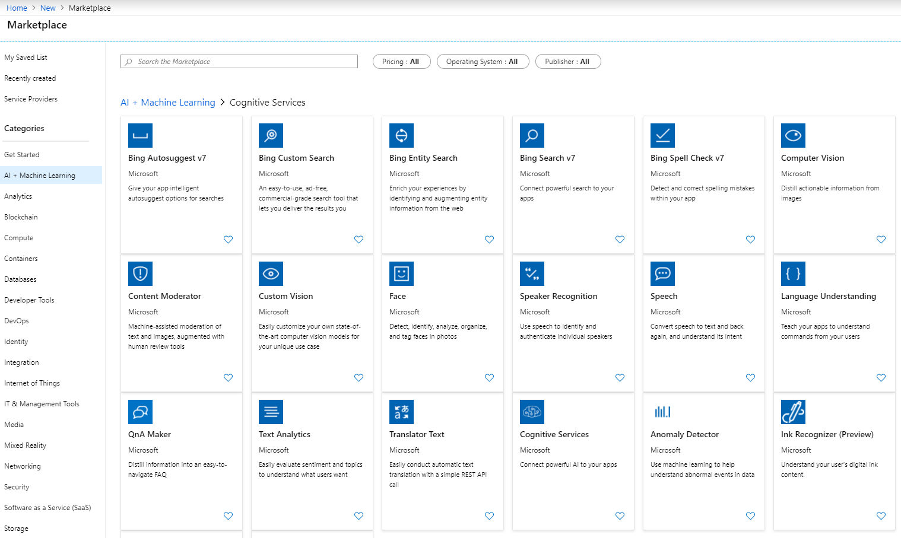
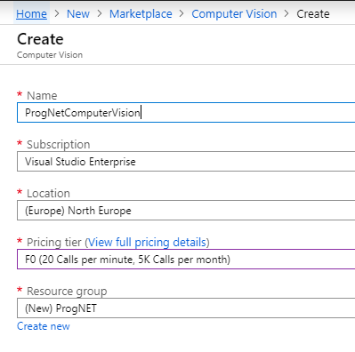
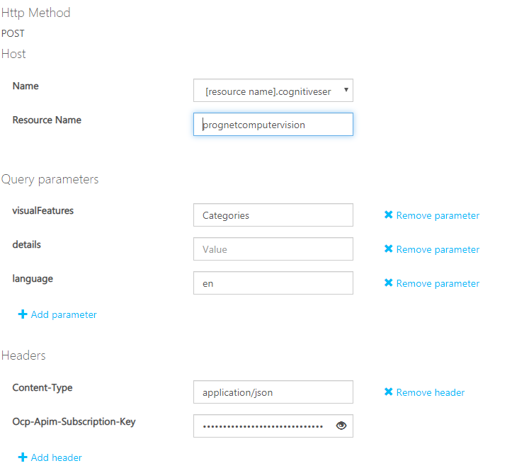
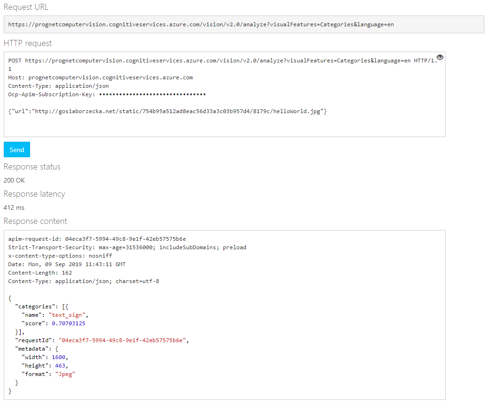

# Creating Computer Vision API

## Activity Steps
### Create Cognitive Services
1. Go to Azure to Create a new Cognitive Services: Vision API
Create a Resource -> AI + Machine Learning -> Cognitive Services -> Computer Vision

2. Create a Computer Vision

3. Add details about Computer Vision
 * Add a new Name (Name need to be unique per location)
 * Select your subscription
 * Select Location
 * Choose Pricing Tier (F0 is a Free one good for development and testing application)
 * Create a new Resource Group

4. When you deployment is complete go to resource

5. Your key and endpoint will be used later to connect to Azure Cognitive Services

###Test Cognitive Services
6. Go to Swagger and choose your region: [Cognitive Services Swagger](http://bit.ly/csswagger)

7. Fill all data: your resource name (it’s beginning of URL) and your key

8. Add URL with the picture and click send to check that your API working correctly

9. Test different endpoint to check the result from Computer Vision
