# Creating Custom Vision API

## Activity Steps
### Create Cognitive Services

1. Go to Azure Portal and select new Resource and Find **Custom Vision**
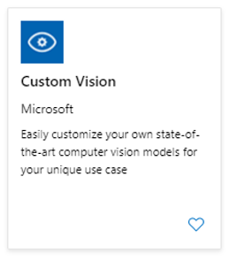

2. Click to create a new **Custom Vision** API
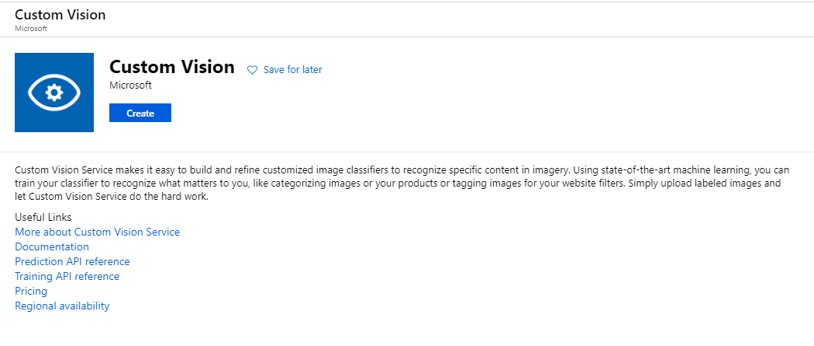

3. Fill data with the all data like shown below (use the same resource group that you create in Activity 1)

4. Now you have your Endpoint and Key that can be used in the [Custom Vision Portal](https://customvision.ai)
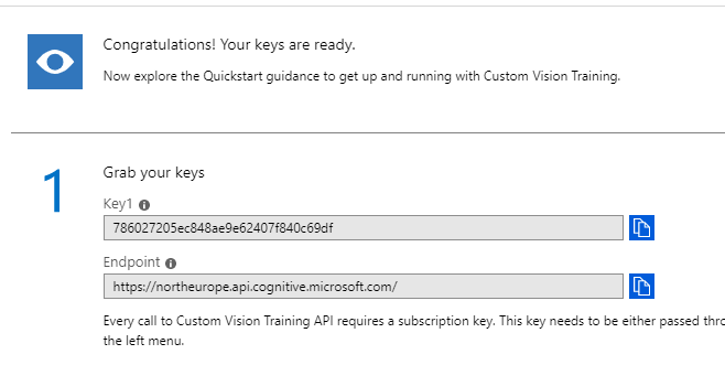

5. Go to the [Custom Vision Portal](https://customvision.ai) and select settings to see that your Custom Vision API was created. You need to login with the same credentails that you login into Azure Portal

6. Back to main page and create a new project
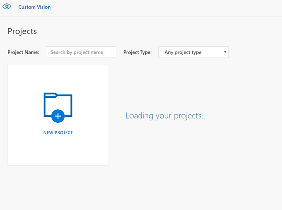

7. Put name, description and resource.
  Select: 
    Project Types: Classification
    Classification Types: Multiclass (Single tag per image)
    Domains: General
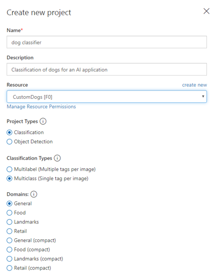

8. Now we can start adding images and assigning them tags to create our image classifier. 
* Click Add Images and Select all images from [beagle folder](https://github.com/gosiaborzecka/ProgNetWorkshop/tree/master/steps/03-CreateCustomVision/images/beagle) and tag them as **beagle**

* Click Add Images and Select all images from [bernese-mountain-dog folder](https://github.com/gosiaborzecka/ProgNetWorkshop/tree/master/steps/03-CreateCustomVision/images/bernese-mountain-dog)  and tag them as **bernese-mountain-dog**

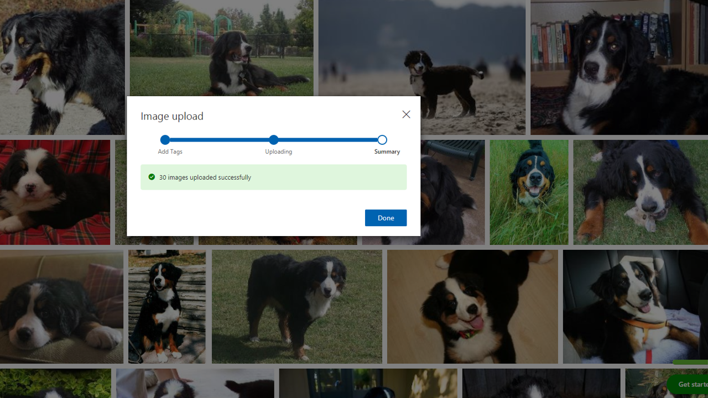

* Click Add Images and Select all images from [chihuahua folder](https://github.com/gosiaborzecka/ProgNetWorkshop/tree/master/steps/03-CreateCustomVision/images/chihuahua)  and tag them as **chihuahua**
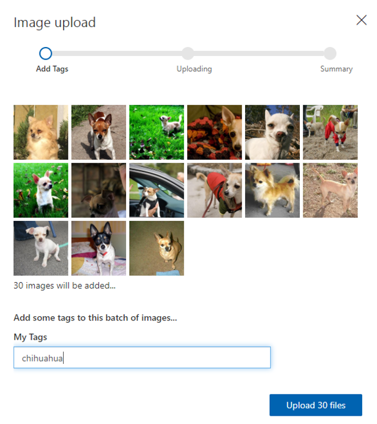
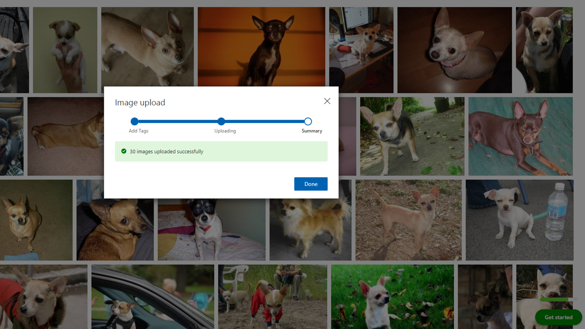

* Click Add Images and Select all images from [eskimo-dog folder](https://github.com/gosiaborzecka/ProgNetWorkshop/tree/master/steps/03-CreateCustomVision/images/eskimo-dog)  and tag them as **eskimo-dog**

* Click Add Images and Select all images from [german-shepherd folder](https://github.com/gosiaborzecka/ProgNetWorkshop/tree/master/steps/03-CreateCustomVision/images/german-shepherd)  and tag them as **german-shepherd**
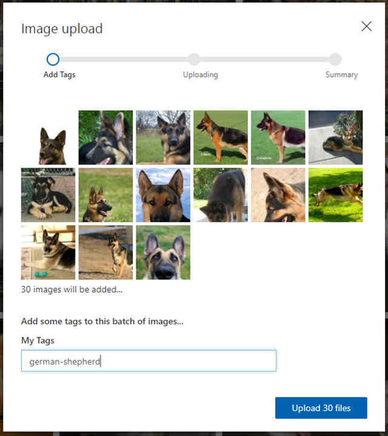
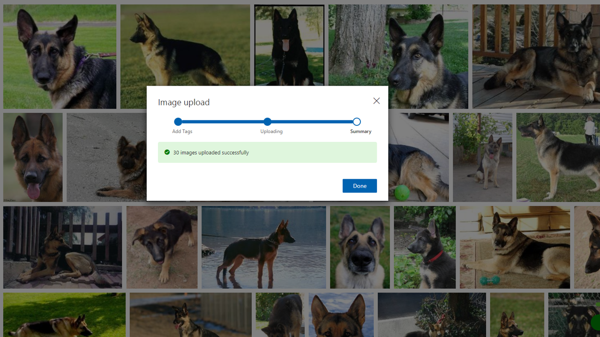

* Click Add Images and Select all images from [golden-retriever folder](https://github.com/gosiaborzecka/ProgNetWorkshop/tree/master/steps/03-CreateCustomVision/images/golden-retriever)  and tag them as **golden-retriever**

* Click Add Images and Select all images from [maltese-dog folder](https://github.com/gosiaborzecka/ProgNetWorkshop/tree/master/steps/03-CreateCustomVision/images/maltese-dog)  and tag them as **maltese-dogr**
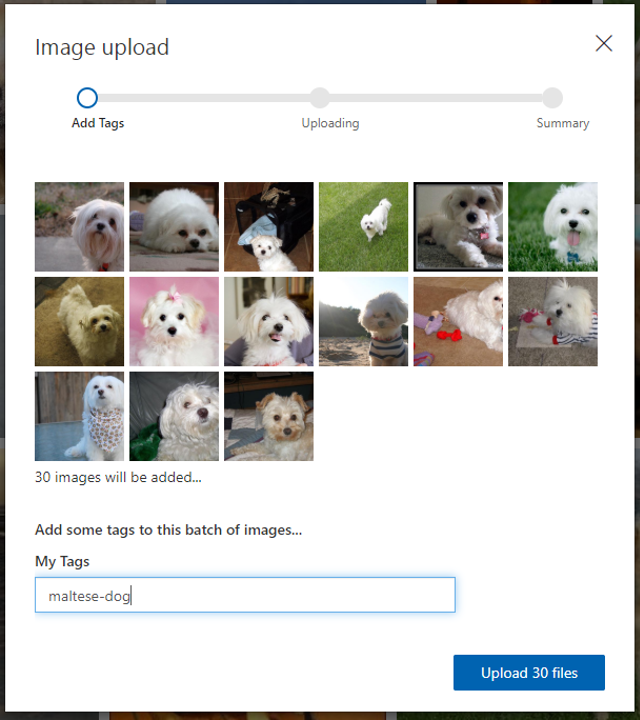
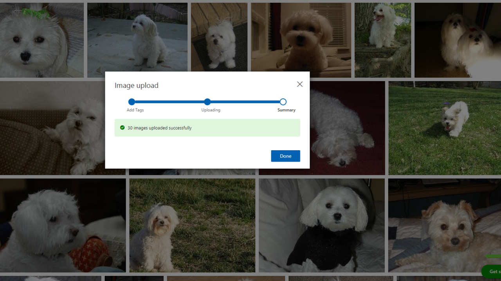

9. When all images are uploaded and tagged we can train our model

10. When model train is completed we can check the performance of the model and performance per tag

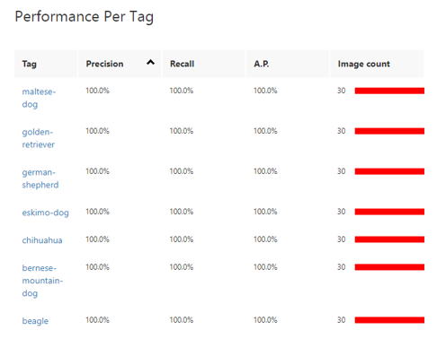

11. Now it's time to test our model with images form [testset folder](https://github.com/gosiaborzecka/ProgNetWorkshop/tree/master/steps/03-CreateCustomVision/testset)

12. Go to Prediction and see how Custom Vision tags images. You can tag them by yourself and then this images will be added into your model

13. Train once again the model

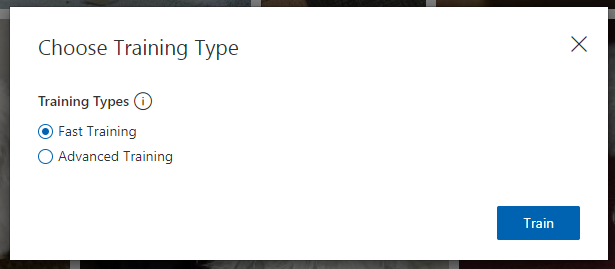

14. Now we have our Iteration 2 and we can go an publish our model

15. Click the publish button, add the model name and choose the prediction resource

16. Now we have our model that we can use in custom applications

