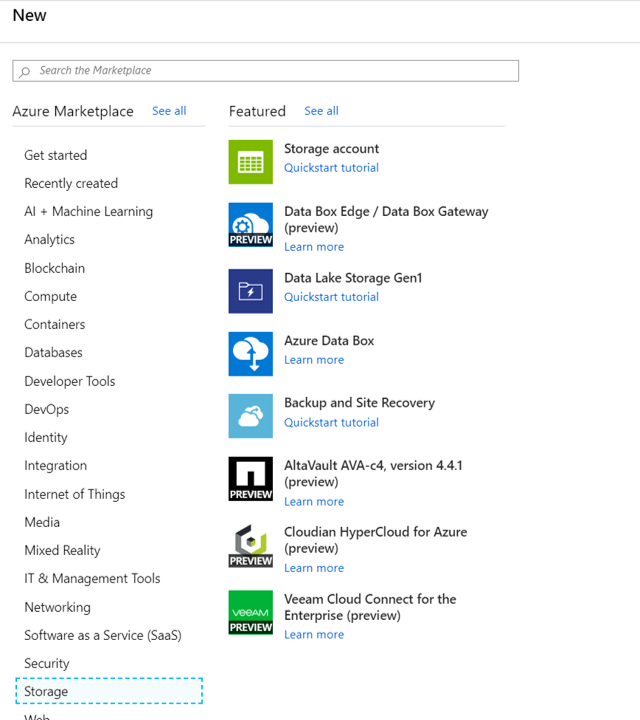
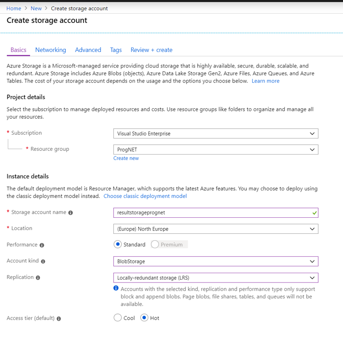
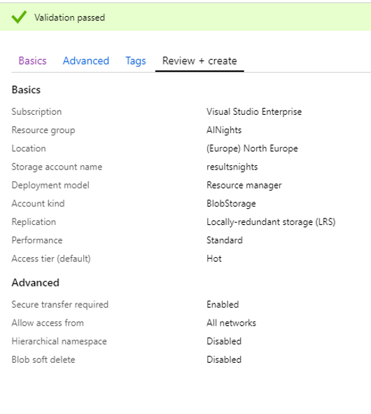

# Creating Logic Apps

## Activity Steps
### Create Logic Apps

1. Go to the azure portal and click create new resource in the top left corner. Select the section Storage and choose the first option Storage Account.

2. Fill all data like shown below

3. When validation is passed, go to create a storage

4. Go to Resource and click **Blob**

5. Create a new **Container** by adding name **image** and chose Public access level: Container (anonymous read access for containers and blobs)

6. Create a new **Container** with the name **results**

7. Before we starting create a logic apps, check that Microsoft Event Grid is Register. To do that go to your Subscription, select subscription you working on, click Resource Providers and find Microsoft Event Grid

8. Click the Register button and wait few second that registration will finish

9. Time to create Logic Apps. Click Add New Resource and find LogicApp

10. Add the name, use the same resource that you use before for this exercice and click create

11. First we going to add first step **When the Event Grid resources event occurs**

12. Sign in to your Azure tenant to use Event Grid

13. We want to check if on our blob will be added any image, to do that we need to fill the step as below

14. Next step is parse the json of the image that we will need to proceed

15. In Conent add Body (don't type, select the Body from dynamic content) and in schema copy the json from the [JSON file]()

